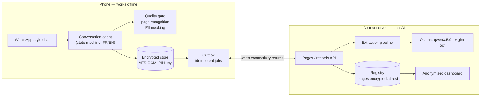

# DayOne — a midwife, a phone and an AI

**An offline-first, WhatsApp-style agent that turns photos of the paper maternal registry
into a structured, verified and longitudinal digital record — 100 % local AI, nothing sent
to a third party.**

> **En bref (FR)** — La sage-femme continue de remplir le registre papier. Elle le
> photographie avec son téléphone, même sans réseau : la photo est contrôlée, la page
> reconnue, les données personnelles masquées, le tout chiffré sur le téléphone. Au
> retour du réseau, des modèles d'IA *locaux* lisent chaque champ ; l'agent lui montre ce
> dont il doute (avec la raison, une autre lecture possible et l'image), elle confirme ou
> corrige, puis rattache la visite à la bonne patiente. Rien n'est perdu, rien n'est
> dupliqué, aucune décision n'est prise à sa place.

## Results (test split, held-out patients)

See [docs/RESULTS.md](docs/RESULTS.md) (generated by `make report`) and the protocol,
pre-registered before the numbers, in [docs/EVALUATION.md](docs/EVALUATION.md).

<!-- RESULTS:START -->
| Test split: 40 pages of 5 held-out patients (same 5 handwriting fonts as calibration) | |
|---|---|
| **Extraction accuracy**, handwritten fields, before any review (n = 3480; unaltered renders + simulated mild + medium photos) | **93.4 %** (95 % CI 91.5–95.6) |
| … medium photos only (WhatsApp-like; FR + AR + EN) | 87.8 % (95 % CI 83.9–91.0) |
| … unaltered render / mild / medium (French specimen) | 99.3 % / 99.2 % / 89.1 % |
| … medium photos: Arabic-script / Latin-script fields | 69.1 % / 93.5 % |
| … medium photos in 2 handwriting fonts never seen in development | 83.8 % (95 % CI 80.5–88.5) (same pages in the original fonts: 89.1 %) |
| Handwritten fields accepted without any question | 93.4 % |
| **Wrong among the values accepted without a question** | **1.9 %** (95 % CI 1.3–2.6); medium photos 3.3 %; Arabic-script fields 14.3 % |
| Tick boxes / blank fields recognised | 99.8 % / 4724 of 4725 |
| Page type recognised | 100.0 % (thresholds set on all pages, optimistic) |

Acceptance threshold τ = 0.50, chosen on the calibration patients 1-5 (it is the floor of the search grid; without the floor the rule gives τ = 0.42 and 2.2 % on test). The 2 % silent-error target is **not demonstrated** on test (its interval crosses 2 %). Full tables, calibration and risk–coverage: [docs/RESULTS.md](docs/RESULTS.md).
<!-- RESULTS:END -->

## What it does (challenge tasks → where)

| Task | Implementation |
|---|---|
| 1. Field schema & status model | 601 typed fields over 8 page types, 6 statuses — [`forms/layout.py`](src/dayone/forms/layout.py), [`schema.py`](src/dayone/schema.py), [docs/DESIGN.md §1-2](docs/DESIGN.md) |
| 2. Extraction with status + confidence per field, evaluated | registration + pixel reading + local OCR (qwen3.5:9b, glm-ocr) + rules + calibrated confidence — [`extraction/`](src/dayone/extraction), evaluation in [`evaluation/`](src/dayone/evaluation) |
| 3. Conversational review (confirm / edit / retake, follow-up questions, manual entry) | deterministic agent, FR/EN — [`device/agent.py`](src/dayone/device/agent.py) |
| 4. Offline mode | encrypted store, persistent outbox, idempotent sync, crash recovery — [`device/store.py`](src/dayone/device/store.py), [`device/sync.py`](src/dayone/device/sync.py) |
| 5. Record lifecycle | explicit state machine with history — [docs/LIFECYCLE.md](docs/LIFECYCLE.md) |
| 6. Patient linking | code (always confirmed) + OCR-confusion tolerance + non-identifying attributes, never auto-create — [`linking.py`](src/dayone/linking.py) |
| Continuous profile | *📁 Dossiers* / *dossier <code>*: the patient's longitudinal record (visits with date, GA, weight, BP; tests; delivery; postpartum) — [`records.py`](src/dayone/records.py) |
| 7. Multi-page sessions & re-digitisation | one record per registry, field-by-field diff — [`records.py`](src/dayone/records.py) |
| 8. Original image kept | redacted photo, encrypted, linked to record id, capture date, midwife id, processing status; role-based access with audit — [`server/app.py`](src/dayone/server/app.py) |
| Bonus | quality check before accepting a capture, Arabic/multilingual robustness (evaluated), anonymised dashboard, FR/EN interface, WhatsApp Cloud API adapter ([docs/WHATSAPP.md](docs/WHATSAPP.md)) |

## Architecture



Two processes: the **phone** (simulated in the browser, port 8000) and the **processing
server** (port 8100). Only AI reading and synchronisation need the network; capture,
quality check, page recognition, PII masking, encrypted storage, review of already-read
records, manual entry and patient matching all run on the phone.

## Quick start

Requirements: macOS/Linux, Python 3.12 with [uv](https://docs.astral.sh/uv/),
[Ollama](https://ollama.com) ≥ 0.19 running locally, ~10 GB of disk for the models.
The organisers' data must be in `data/` (`data/Paper Registry/…`, `data/maternal_registry_synthetic.csv`).

```bash
make install        # Python environment
make models         # ollama pull qwen3.5:9b && ollama pull glm-ocr
make prepare        # ground truth from the specimen PDF + blank templates (≈ 30 s)
make test           # 75 tests, no AI model needed (≈ 30 s)
make demo-offline   # phone http://127.0.0.1:8000 (starts offline) + server http://127.0.0.1:8100/dashboard
```

Demo walkthrough: [docs/DEMO.md](docs/DEMO.md). Reproduce the evaluation:

```bash
make dataset        # 416 simulated captures (seeded), incl. Arabic / English / mixed pages
make eval           # pipeline on every capture — resumable, ≈ 3 h on an Apple M4 Pro
make calibrate      # confidence model + acceptance threshold, calibration split only
make report         # docs/RESULTS.md
```

## Repository layout

```
src/dayone/
  schema.py              statuses, field specs, extraction results
  forms/                 registry layout (601 fields, PII zones) and blank templates
  extraction/            quality gate, registration, pixel reading, OCR, parsing, rules, confidence, pipeline
  records.py linking.py pii.py
  device/                phone: encrypted store, lifecycle, sync/outbox, agent, i18n, web simulator
  server/                processing server, role-based image access, dashboard
  channels/whatsapp.py   WhatsApp Cloud API adapter (off by default)
  evaluation/            ground truth, capture simulator, multilingual pages, dataset, metrics, report
tests/                   75 tests (offline chaos, end-to-end conversation, pixel pipeline, ...)
docs/                    DESIGN, LIFECYCLE, EVALUATION (protocol), RESULTS, DEMO, WHATSAPP
```

## Known limitations

* **Arabic is the weak point** (medium photos, font-rendered — real handwriting is harder):
  fields written in Arabic letters 69.1 % accuracy with 14.3 % of the values accepted without a
  question wrong; values written in **Eastern-Arabic digits (٠-٩) are essentially unreadable**
  (2 % accuracy) and most of them are accepted wrongly — do not deploy with Eastern-Arabic
  digits before adding a dedicated reader. Latin-script fields: 93.5 %.
* **New handwriting costs accuracy**: the test patients reuse the calibration's five
  handwriting fonts; on two fonts never seen in development, medium-photo accuracy drops from
  89.1 % to 83.8 % and silent errors rise from 2.9 % to 4.4 % (same pages).
* **The 2 % silent-error target is not demonstrated** on the test patients (1.9 %, 95 % CI
  1.3-2.6 %; 3.3 % on medium photos).
* **Forced bad photos are dangerous**: on `severe` captures the quality gate asks for a
  retake 97.5 % of the time; if the midwife forces one through anyway, 62.5 % of the values
  accepted without a question are wrong. Next step (not evaluated): accept nothing
  automatically on a capture the quality gate rejected.

* **One layout.** Templates exist for the specimen booklet only. The organisers' real
  photos of the official booklet (`1-*.jpg`) have a different layout: they are recognised
  as unknown pages and *not stored* (their identifier zones cannot be masked); the midwife
  can type the page in. Supporting a new booklet = one blank template + its field
  coordinates (`forms/layout.py`); the rest of the pipeline is layout-agnostic.
* **Simulated field conditions.** The provided PNGs are clean renders; captures are
  simulated (perspective, blur, shadows, low light, JPEG). Arabic and English
  handwriting is simulated with fonts — real Arabic handwriting is more varied.
* **Development thresholds saw all pages** (registration, tick boxes, quality gate): see
  [EVALUATION.md §6](docs/EVALUATION.md). Confidence and τ were fitted on the calibration
  split only.
* **Speed.** ≈ 0.8 s per handwritten field on an M4 Pro: a dense visits page takes 1-2 min.
  Processing is asynchronous, so the midwife is not blocked, but a weaker server would be
  slower.
* **Real WhatsApp** moves the agent to a gateway: capture still works offline (WhatsApp
  queues photos), manual entry does not. The adapter is not tested against Meta's live
  servers.
* **Security is a prototype**: demo tokens instead of an identity provider, the PIN is fixed
  for the demo, no key rotation or remote wipe.
* **Hepatitis C**: the specimen form has no hepatitis C row (it records HIV, syphilis and
  Ag HBs); the dashboard shows hepatitis C from the reference CSV only.
* **Out of scope by design**: no risk prediction, triage, diagnosis or treatment advice.
  Consistency rules only check that what is written is internally consistent.
