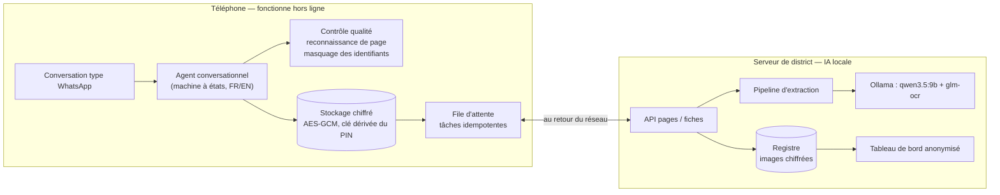

# DayOne — une sage-femme, un téléphone et une IA

▶️ **[Vidéo de démonstration (3 min 40, vrai WhatsApp)](https://github.com/YoussefChaouki/dayone-codeml/releases/download/v1.0/DayOne-demo-x1.25.mp4)**
— capture hors ligne avec les identifiants masqués, retour de la connexion, lecture par l'IA et
révision d'un champ incertain, confirmation du code patiente, puis décision de correspondance
lors d'une deuxième visite.

**Un agent conversationnel de type WhatsApp, hors ligne d'abord, qui transforme les photos du
registre maternel papier en un dossier numérique structuré, vérifié et longitudinal — IA 100 %
locale, aucune donnée envoyée à un tiers.**

> **En bref** — La sage-femme continue de remplir son registre papier. Elle le photographie avec
> son téléphone, même sans réseau : la photo est contrôlée, la page reconnue, les données
> personnelles masquées, le tout chiffré sur le téléphone. Au retour du réseau, des modèles d'IA
> *locaux* lisent chaque champ ; l'agent lui montre ce dont il doute (avec la raison, une autre
> lecture possible et l'image), elle confirme ou corrige, puis rattache la visite à la bonne
> patiente. Rien n'est perdu, rien n'est dupliqué, aucune décision n'est prise à sa place.

## Résultats (patientes tenues à l'écart)

Tableaux complets : [docs/RESULTS.md](docs/RESULTS.md) (généré par `make report`). Protocole,
pré-enregistré avant les chiffres : [docs/EVALUATION.md](docs/EVALUATION.md).

<!-- RESULTS:START -->
| Test : 40 pages de 5 patientes tenues à l'écart (mêmes 5 polices manuscrites que la calibration) | |
|---|---|
| **Exactitude de l'extraction**, champs manuscrits, avant toute révision (n = 3480 ; rendus d'origine + photos simulées légères et moyennes) | **93,4 %** (IC 95 % 91,5–95,6) |
| … photos moyennes seules (type WhatsApp ; FR + AR + EN) | 87,8 % (IC 95 % 83,9–91,0) |
| … rendu d'origine / photo légère / photo moyenne (spécimen français) | 99,3 % / 99,2 % / 89,1 % |
| … photos moyennes : champs en lettres arabes / en écriture latine | 69,1 % / 93,5 % |
| … photos moyennes avec 2 polices manuscrites jamais vues pendant le développement | 83,8 % (IC 95 % 80,5–88,5) (mêmes pages dans les polices d'origine : 89,1 %) |
| Champs manuscrits acceptés sans aucune question | 93,4 % |
| **Valeurs fausses parmi celles acceptées sans question** | **1,9 %** (IC 95 % 1,3–2,6) ; photos moyennes 3,3 % ; champs en lettres arabes 14,3 % |
| Cases à cocher / champs vides reconnus | 99,8 % / 4724 sur 4725 |
| Type de page reconnu | 100,0 % (seuils réglés sur toutes les pages, optimiste) |

Seuil d'acceptation τ = 0,50, choisi sur les patientes de calibration 1-5 (c'est le plancher de la grille de recherche ; sans ce plancher, la règle donne τ = 0,42 et 2,2 % en test). L'objectif de 2 % d'erreurs silencieuses n'est **pas démontré** en test (son intervalle franchit 2 %). Tableaux complets, calibration et risque–couverture : [docs/RESULTS.md](docs/RESULTS.md).
<!-- RESULTS:END -->

## Ce que fait la solution (tâches du défi → où)

| Tâche | Réalisation |
|---|---|
| 1. Schéma de champs et modèle de statuts | 601 champs typés sur 8 types de page, 6 statuts — [`forms/layout.py`](src/dayone/forms/layout.py), [`schema.py`](src/dayone/schema.py), [docs/DESIGN.md §1-2](docs/DESIGN.md) |
| 2. Extraction avec statut et confiance par champ, évaluée | recalage + lecture des pixels + OCR local (qwen3.5:9b, glm-ocr) + règles de cohérence + confiance calibrée — [`extraction/`](src/dayone/extraction), évaluation dans [`evaluation/`](src/dayone/evaluation) |
| 3. Révision conversationnelle (confirmer / corriger / reprendre la photo, questions de suivi, saisie manuelle) | agent déterministe, FR/EN — [`device/agent.py`](src/dayone/device/agent.py) |
| 4. Mode hors ligne | stockage chiffré, file d'attente persistante, synchronisation idempotente, reprise après crash — [`device/store.py`](src/dayone/device/store.py), [`device/sync.py`](src/dayone/device/sync.py) |
| 5. Cycle de vie des fiches | machine à états explicite avec historique — [docs/LIFECYCLE.md](docs/LIFECYCLE.md) |
| 6. Liaison patiente | code (toujours confirmé) + tolérance aux erreurs de lecture + attributs non identifiants, jamais de création automatique — [`linking.py`](src/dayone/linking.py) |
| Dossier continu | *📁 Dossiers* / *dossier <code>* : le dossier longitudinal de la patiente (visites avec date, âge gestationnel, poids, TA ; tests ; accouchement ; post-partum) — [`records.py`](src/dayone/records.py) |
| 7. Sessions multipages et renumérisation | une fiche par registre, différences champ par champ — [`records.py`](src/dayone/records.py) |
| 8. Image d'origine conservée | photo masquée, chiffrée, liée à l'identifiant de la fiche, à la date de capture, à la sage-femme et au statut ; accès par rôle avec journal d'audit — [`server/app.py`](src/dayone/server/app.py) |
| Bonus | contrôle qualité avant d'accepter une photo, robustesse arabe/multilingue (mesurée), tableau de bord anonymisé, interface FR/EN, **vrai WhatsApp** (Cloud API, testé en conditions réelles — [docs/WHATSAPP.md](docs/WHATSAPP.md)) |

## Architecture



Deux processus : le **téléphone** (simulé dans le navigateur, port 8000) et le **serveur de
traitement** (port 8100). Seules la lecture par l'IA et la synchronisation ont besoin du réseau ;
la capture, le contrôle qualité, la reconnaissance de page, le masquage, le stockage chiffré, la
révision des fiches déjà lues, la saisie manuelle et la liaison patiente fonctionnent sur le
téléphone.

## Démarrage rapide

Prérequis : macOS/Linux, Python 3.12 avec [uv](https://docs.astral.sh/uv/),
[Ollama](https://ollama.com) ≥ 0.19 lancé en local, ~10 Go de disque pour les modèles.
Les données des organisateurs doivent être dans `data/` (`data/Paper Registry/…`,
`data/maternal_registry_synthetic.csv`).

```bash
make install        # environnement Python
make models         # ollama pull qwen3.5:9b && ollama pull glm-ocr
make prepare        # vérité terrain depuis le PDF spécimen + gabarits vierges (≈ 30 s)
make test           # 87 tests, sans modèle d'IA (≈ 40 s)
make demo-offline   # téléphone http://127.0.0.1:8000 (démarre hors ligne) + serveur http://127.0.0.1:8100/dashboard
```

Parcours de démonstration : [docs/DEMO.md](docs/DEMO.md). Vrai WhatsApp :
[docs/WHATSAPP.md](docs/WHATSAPP.md) (`make demo-whatsapp` + `make tunnel`).

Reproduire l'évaluation :

```bash
make dataset        # 416 captures simulées (graines fixes), dont pages arabes / anglaises / mixtes
make eval           # pipeline sur chaque capture — reprenable, ≈ 3 h sur un Apple M4 Pro
make calibrate      # modèle de confiance + seuil d'acceptation, sur le jeu de calibration seul
make unseen         # expérience complémentaire : 2 polices manuscrites jamais vues (≈ 30 min)
make report         # docs/RESULTS.md et le bloc de résultats ci-dessus
```

## Organisation du dépôt

```
src/dayone/
  schema.py              statuts, spécifications des champs, résultats d'extraction
  forms/                 mise en page du registre (601 champs, zones d'identifiants) et gabarits vierges
  extraction/            contrôle qualité, recalage, lecture des pixels, OCR, normalisation, règles, confiance, pipeline
  records.py linking.py pii.py
  device/                téléphone : stockage chiffré, cycle de vie, synchronisation, agent, i18n, simulateur web
  server/                serveur de traitement, accès aux images par rôle, tableau de bord
  channels/whatsapp.py   canal WhatsApp Cloud API (désactivé par défaut)
  evaluation/            vérité terrain, simulateur de photos, pages multilingues, jeu de données, métriques, rapport
tests/                   87 tests (chaos réseau, conversation de bout en bout, pipeline pixels, WhatsApp…)
docs/                    DESIGN, LIFECYCLE, EVALUATION (protocole), RESULTS, DEMO, WHATSAPP
```

Le code, les commentaires et les messages de commit sont en anglais ; la documentation et
l'agent conversationnel sont en français (l'agent parle aussi anglais : *language en*).

## Limites connues

* **L'arabe est le point faible** (photos moyennes, écriture rendue par des polices — une vraie
  écriture manuscrite est plus difficile) : 69,1 % d'exactitude sur les champs écrits en lettres
  arabes, et 14,3 % des valeurs acceptées sans question y sont fausses ; les valeurs en **chiffres
  arabes orientaux (٠-٩) sont pratiquement illisibles** (2 %) et presque toutes acceptées à tort —
  à ne pas déployer avec ces chiffres avant d'ajouter un lecteur dédié. Champs en écriture latine :
  93,5 %.
* **Une nouvelle écriture coûte en exactitude** : les patientes de test réutilisent les cinq
  polices manuscrites de la calibration ; sur deux polices jamais vues, l'exactitude sur photos
  moyennes passe de 89,1 % à 83,8 % et les erreurs silencieuses de 2,9 % à 4,4 % (mêmes pages).
* **L'objectif de 2 % d'erreurs silencieuses n'est pas démontré** sur les patientes de test
  (1,9 %, IC 95 % 1,3–2,6 % ; 3,3 % sur photos moyennes).
* **Une photo très dégradée forcée est dangereuse** : sur les captures `severe`, le contrôle
  qualité demande de reprendre la photo dans 97,5 % des cas ; si la sage-femme force quand même,
  62,5 % des valeurs acceptées sans question sont fausses. Étape suivante (non évaluée) : n'accepter
  aucune valeur automatiquement sur une capture refusée par le contrôle qualité.
* **Une seule mise en page.** Les gabarits couvrent le livret spécimen uniquement. Les vraies photos
  du livret officiel fournies par les organisateurs (`1-*.jpg`) ont une autre mise en page : elles
  sont reconnues comme pages inconnues et *non stockées* (leurs zones d'identifiants ne peuvent pas
  être masquées) ; la sage-femme peut saisir la page à la main. Ajouter un livret = un gabarit
  vierge + les coordonnées de ses champs (`forms/layout.py`) ; le reste du pipeline est générique.
* **Conditions de terrain simulées.** Les PNG fournis sont des rendus propres ; les photos sont
  simulées (perspective, flou, ombres, faible lumière, JPEG). L'arabe et l'anglais sont simulés par
  des polices.
* **Certains seuils de développement ont vu toutes les pages** (recalage, cases à cocher, contrôle
  qualité) : voir [EVALUATION.md §6](docs/EVALUATION.md). La confiance et τ ont été ajustés sur la
  calibration uniquement.
* **Vitesse.** ≈ 0,8 s par champ manuscrit sur un M4 Pro : la page dense des visites prend 1 à
  2 min. Le traitement est asynchrone, la sage-femme n'est pas bloquée, mais un serveur plus modeste
  serait plus lent.
* **Le vrai WhatsApp** déplace l'agent sur une passerelle : la capture reste possible hors ligne
  (WhatsApp met les photos en attente), pas la saisie manuelle. Le jeton Meta de test est temporaire.
* **Sécurité de prototype** : jetons de démonstration au lieu d'un fournisseur d'identité, PIN fixe
  pour la démo, pas de rotation de clés ni d'effacement à distance.
* **Écarts dus au formulaire spécimen** : il n'a pas de ligne **hépatite C** (il relève VIH,
  syphilis et Ag HBs — l'hépatite C n'apparaît que dans le tableau de bord, via le CSV de
  référence), pas de **température** dans le tableau des visites prénatales (seulement en
  post-partum), et pas de **village** (région et province sont relevées).
* **Hors périmètre, volontairement** : ni prédiction du risque, ni triage, ni diagnostic, ni
  recommandation de traitement. Les règles de cohérence vérifient seulement que ce qui est écrit
  est cohérent.
