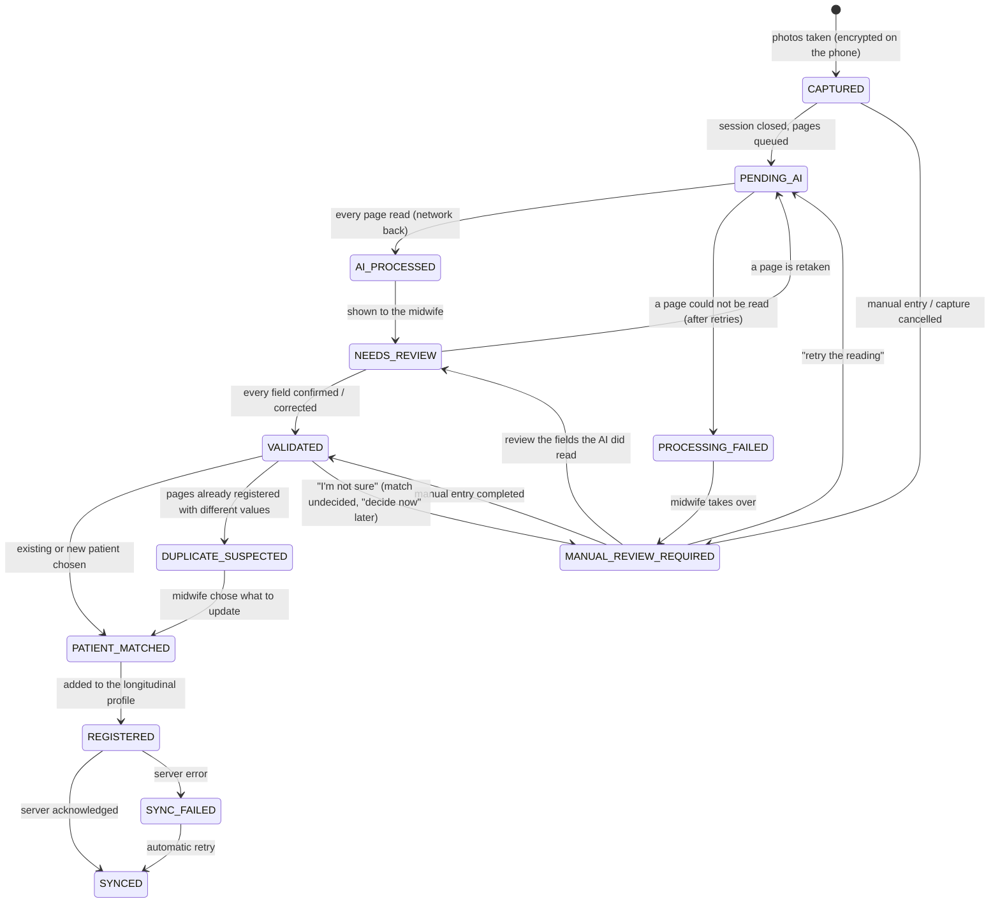

# Record lifecycle

A *record* is one registry photographed (or typed) in one session: one or more pages.
States and transitions are enforced by [`device/lifecycle.py`](../src/dayone/device/lifecycle.py);
any other transition raises `InvalidTransition`. Every transition is appended to the
record's history with its time, actor (midwife, agent, sync) and reason — shown live in the
demo's backstage panel.

| State (FR label) | Meaning | Needs network? | What happens next |
|---|---|---|---|
| CAPTURED (CAPTURÉ) | photos stored encrypted, PII masked | no | midwife taps *Terminer* |
| PENDING_AI (EN_ATTENTE_IA) | page jobs in the outbox | yes | uploaded and read when online |
| AI_PROCESSED (TRAITÉ_IA) | all extractions received | no | agent notifies the midwife |
| NEEDS_REVIEW (À_RÉVISER) | doubtful fields being reviewed | no | confirm / edit / retake |
| VALIDATED (VALIDÉ) | every field decided by the midwife | no | patient matching |
| PATIENT_MATCHED (PATIENTE_LIÉE) | linked to a profile | no | registration |
| REGISTERED (ENREGISTRÉ) | in the longitudinal profile, sync job queued | yes | pushed when online |
| SYNCED (SYNCHRONISÉ) | acknowledged by the server | — | final (corrections after sync are out of scope) |
| PROCESSING_FAILED (ÉCHEC_TRAITEMENT) | a page could not be read: server errors (4 attempts), model server down (10 attempts, back-off 2 s → 10 min, ≈ 30 min) or page not recognised | — | immediately handed over: MANUAL_REVIEW_REQUIRED |
| SYNC_FAILED (ÉCHEC_SYNCHRONISATION) | server refused / failed | yes | retried with back-off until acknowledged |
| DUPLICATE_SUSPECTED (DOUBLON_SUSPECTÉ) | re-digitised pages differ from the profile | no | midwife picks old/new per field |
| MANUAL_REVIEW_REQUIRED (RÉVISION_MANUELLE_REQUISE) | AI cannot help, match undecided, or capture cancelled | no | manual entry, "retry the reading", review of fields already read, or "decide now" |

## Why nothing is lost

1. The photo is masked, encrypted and committed before the midwife sees "Page reçue". A
   photo awaiting "keep anyway" (quality warning) is still unmasked, so it is kept in memory
   only and is lost — not stored — if the app dies; the midwife is asked to retake it.
2. A state change and the outbox job it requires are written in one SQLite transaction
   (WAL, `synchronous=FULL`); multi-step operations (registration: profile + link + two
   transitions + sync job; processing failure) are a single transaction too.
3. Jobs are idempotent on the server: `POST /v1/pages` is keyed by the page id,
   `POST /v1/records` by record id + version. A lost response is replayed without creating
   a duplicate.
4. On start-up the sync engine re-creates any job a crash may have prevented and settles
   records whose pages all answered before the crash (`SyncEngine.recover`).
5. Offline is not an error: an offline attempt is not counted as a failure and the job
   waits; only server errors consume attempts.

Verified by `tests/test_sync_offline.py` (offline capture, lost response, crash between
upload and result, server errors, AI unavailable then retried, and a property-based chaos
test) and `tests/test_agent_e2e.py` (crash in the middle of a registration rolls back).
