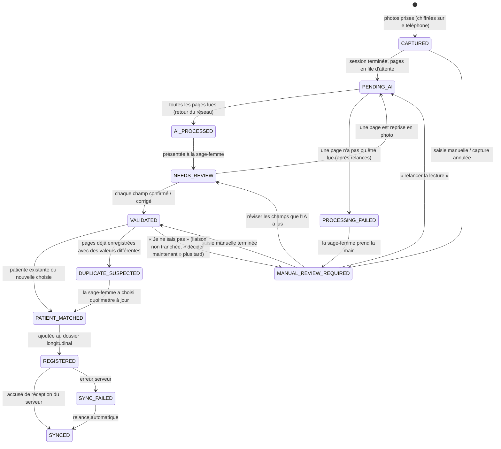

# Cycle de vie d'une fiche

Une *fiche* est un registre photographié (ou saisi) au cours d'une session : une ou plusieurs
pages. Les états et les transitions sont imposés par
[`device/lifecycle.py`](../src/dayone/device/lifecycle.py) ; toute autre transition lève
`InvalidTransition`. Chaque transition est ajoutée à l'historique de la fiche avec son heure,
son auteur (sage-femme, agent, synchronisation) et sa raison — affichés en direct dans le panneau
« coulisses » de la démo.

Les noms d'états du code sont en anglais ; l'application affiche leur libellé français.

| État (libellé affiché) | Signification | Réseau nécessaire ? | Étape suivante |
|---|---|---|---|
| CAPTURED (CAPTURÉ) | photos stockées chiffrées, identifiants masqués | non | la sage-femme touche *Terminer* |
| PENDING_AI (EN_ATTENTE_IA) | tâches des pages dans la file d'attente | oui | envoyées et lues dès que le réseau revient |
| AI_PROCESSED (TRAITÉ_IA) | toutes les extractions reçues | non | l'agent prévient la sage-femme |
| NEEDS_REVIEW (À_RÉVISER) | champs douteux en cours de révision | non | confirmer / corriger / reprendre la photo |
| VALIDATED (VALIDÉ) | chaque champ tranché par la sage-femme | non | liaison patiente |
| PATIENT_MATCHED (PATIENTE_LIÉE) | rattachée à un dossier | non | enregistrement |
| REGISTERED (ENREGISTRÉ) | dans le dossier longitudinal, tâche de synchronisation en file | oui | envoyée dès que le réseau revient |
| SYNCED (SYNCHRONISÉ) | accusé de réception du serveur | — | état final (les corrections après synchronisation sont hors périmètre) |
| PROCESSING_FAILED (ÉCHEC_TRAITEMENT) | une page n'a pas pu être lue : erreurs serveur (4 tentatives), serveur de modèles indisponible (10 tentatives, attente 2 s → 512 s, ≈ 17 min) ou page non reconnue | — | transmise aussitôt : RÉVISION_MANUELLE_REQUISE |
| SYNC_FAILED (ÉCHEC_SYNCHRONISATION) | le serveur a refusé ou échoué | oui | relancée avec attente croissante jusqu'à l'accusé de réception |
| DUPLICATE_SUSPECTED (DOUBLON_SUSPECTÉ) | les pages renumérisées diffèrent du dossier | non | la sage-femme choisit l'ancienne ou la nouvelle valeur, champ par champ |
| MANUAL_REVIEW_REQUIRED (RÉVISION_MANUELLE_REQUISE) | l'IA ne peut pas aider, liaison non tranchée, ou capture annulée | non | saisie manuelle, « relancer la lecture », révision des champs déjà lus, ou « décider maintenant » |

## Pourquoi rien n'est perdu

1. La photo est masquée, chiffrée et écrite sur disque avant que la sage-femme voie « Page
   reçue ». Une photo en attente de « garder quand même » (avertissement de qualité) n'est pas
   encore masquée : elle reste donc seulement en mémoire et est perdue — pas stockée — si
   l'application s'arrête ; on demande alors à la sage-femme de la reprendre.
2. Un changement d'état et la tâche réseau qu'il nécessite sont écrits dans une seule
   transaction SQLite (WAL, `synchronous=FULL`) ; les opérations en plusieurs étapes
   (enregistrement : dossier + lien + deux transitions + tâche de synchronisation ; échec de
   traitement) forment aussi une seule transaction.
3. Les tâches sont idempotentes côté serveur : `POST /v1/pages` est indexé par l'identifiant de
   page, `POST /v1/records` par identifiant de fiche + version. Une réponse perdue est rejouée
   sans créer de doublon.
4. Au démarrage, le moteur de synchronisation recrée toute tâche qu'un crash aurait pu empêcher
   et finalise les fiches dont toutes les pages avaient reçu leur réponse avant le crash
   (`SyncEngine.recover`).
5. Être hors ligne n'est pas une erreur : une tentative hors ligne ne compte pas comme un échec
   et la tâche attend ; seules les erreurs serveur consomment des tentatives.

Vérifié par `tests/test_sync_offline.py` (capture hors ligne, réponse perdue, crash entre
l'envoi et le résultat, erreurs serveur, IA indisponible puis relancée, et un test de chaos à
base de propriétés) et `tests/test_agent_e2e.py` (un crash au milieu d'un enregistrement est
annulé proprement).
