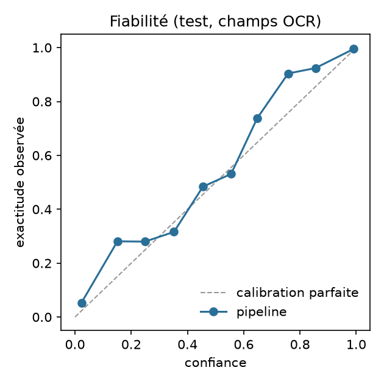
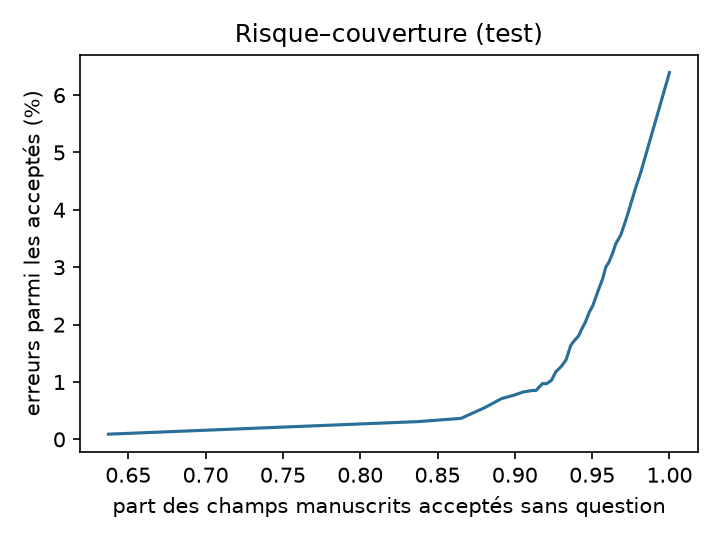

# Résultats

> Généré par `make report` à partir des prédictions enregistrées — ne pas modifier à la main.
> Jeu de test : patientes 6-10 (208 captures de 40 pages). Modèle de confiance `trained`, seuil d'acceptation τ = 0,50 choisi hors échantillon sur les patientes de calibration 1-5.
> Intervalles : bootstrap percentile à 95 % sur les pages (2 000 tirages, graine 0) — les champs d'une même page sont corrélés.

**À lire d'abord.** Les patientes de test sont de nouvelles *valeurs* écrites dans les *mêmes cinq polices manuscrites* que les patientes de calibration (une patiente = une police, appariées entre les deux jeux) ; voir l'expérience « écriture jamais vue » plus bas. Les captures `clean` sont les rendus des organisateurs, non altérés. Les pages arabes et anglaises sont rendues avec des polices.

## Synthèse (rendus d'origine + photos légères + photos moyennes ; français / arabe / anglais)

| Mesure | Valeur |
|---|---|
| Champs manuscrits évalués | 3480 (40 pages, 5 patientes) |
| **Exactitude de l'extraction** (bonne valeur, avant révision) | **93,4 %** (IC 95 % 91,5–95,6) |
| Acceptés sans question | 93,4 % |
| **Valeurs fausses parmi celles acceptées sans question** (erreurs silencieuses) | **1,9 %** (IC 95 % 1,3–2,6) |
| Erreurs silencieuses sur tous les champs (texte, vides, tirets, cases) | 0,6 % |
| Champs sur lesquels la sage-femme est interrogée (tous champs) | 2,0 % |
| Valeurs manuscrites lues à tort comme vides | 0,4 % |
| Champs vides reconnus comme vides | 4724 sur 4725 |
| Tirets reconnus comme « non applicable » | 93,8 % (n=273) |
| Cases à cocher | 99,8 % (n=4137) |
| Reconnaissance du type de page | 100,0 % (seuils réglés sur les 80 pages : optimiste) |
| Calibration de la confiance, champs OCR : ECE / Brier / AUROC | 0,011 / 0,021 / 0,977 |

**Photos moyennes seules** (la condition proche de WhatsApp, FR + AR + EN) : exactitude 87,8 % (IC 95 % 83,9–91,0), erreurs silencieuses 3,3 % (IC 95 % 2,4–4,7).

**Seuil.** La règle pré-enregistrée prend le plus petit τ qui respecte ≤ 2 % d'erreurs silencieuses hors échantillon, mais la grille de recherche commençait à 0,50 (un plancher non déclaré, voir EVALUATION.md §7). Sans ce plancher, la règle donne τ = 0,42 : 2,2 % d'erreurs silencieuses et 94,0 % acceptés en test. Dans les deux cas, l'objectif de 2 % n'est **pas démontré** sur les patientes de test.

## Par niveau de capture (pages du spécimen, français)

| Niveau | n manuscrits | Exactitude | Acceptés sans question | Erreurs silencieuses | Tous champs | Reprise demandée |
|---|---|---|---|---|---|---|
| rendu d'origine (non altéré) | 853 | 99,3 % | 99,8 % | 0,6 % | 99,7 % | 0,0 % |
| photo légère | 853 | 99,2 % | 99,6 % | 0,6 % | 99,7 % | 0,0 % |
| photo moyenne | 853 | 89,1 % | 88,0 % | 2,9 % | 96,2 % | 2,3 % |
| photo très dégradée | 853 | 18,5 % | 24,4 % | 62,5 % | 74,2 % | 97,5 % |

Les photos très dégradées (`severe`) sont renvoyées par le contrôle qualité du téléphone ; leur ligne montre ce qui arriverait si la sage-femme les forçait (la plupart des valeurs fausses, beaucoup acceptées : c'est le contrôle qualité qui protège).

## Par écriture (photos moyennes)

Ce qui est réellement écrit : lettres arabes, chiffres arabes orientaux seuls, ou écriture latine (mots français/anglais et chiffres occidentaux, y compris sur les pages « arabes »).

| Écriture | n | Exactitude | Acceptés sans question | Erreurs silencieuses |
|---|---|---|---|---|
| lettres arabes | 230 | 69,1 % (IC 95 % 56,6–74,9) | 70,0 % | 14,3 % (IC 95 % 10,4–22,6) |
| chiffres arabes orientaux seuls | 49 | 2,0 % (IC 95 % 0,0–7,1) | 14,3 % | 85,7 % (IC 95 % 42,6–100,0) |
| écriture latine | 1495 | 93,5 % (IC 95 % 88,1–96,8) | 92,3 % | 1,6 % (IC 95 % 0,7–3,3) |

Les champs anglais forment un petit vocabulaire fermé (None, Normal, Negative…) plus des nombres, générés à partir des vocabulaires que connaît l'analyseur : leur score dit peu de choses sur l'écriture anglaise.

## Par langue de la page (photos moyennes, pour information)

| Langue | n | Exactitude | Acceptés sans question | Erreurs silencieuses |
|---|---|---|---|---|
| arabe | 413 | 70,5 % | 70,9 % | 9,9 % |
| anglais | 409 | 99,8 % | 99,5 % | 0,0 % |
| français | 952 | 90,2 % | 89,1 % | 2,6 % |

## Écriture jamais vue (complémentaire, pré-enregistrée dans EVALUATION.md §8)

| Mêmes 40 pages de test, photos moyennes | Exactitude | Erreurs silencieuses |
|---|---|---|
| polices d'origine (vues pendant le développement) | 89,1 % (IC 95 % 81,9–94,6) | 2,9 % (IC 95 % 1,4–5,2) |
| Indie Flower / Homemade Apple (jamais vues) | 83,8 % (IC 95 % 80,5–88,5) | 4,4 % (IC 95 % 2,3–7,2) |

2 champ(s) ne tenai(en)t pas dans leur case avec les nouvelles polices et sont exclus.

## Par type de page (rendus d'origine + photos légères + photos moyennes)

| Page | n | Exactitude | Acceptés sans question | Erreurs silencieuses |
|---|---|---|---|---|
| Couverture / établissement | 84 | 89,3 % | 94,0 % | 5,1 % |
| Accouchement | 132 | 90,9 % | 92,4 % | 2,5 % |
| Identification et antécédents | 681 | 91,5 % | 92,4 % | 3,2 % |
| Post-partum précoce — mère | 141 | 92,9 % | 95,0 % | 2,2 % |
| Post-partum précoce — nouveau-né | 252 | 95,6 % | 94,0 % | 0,8 % |
| Post-partum tardif — mère | 120 | 96,7 % | 97,5 % | 0,9 % |
| Post-partum tardif — nouveau-né | 252 | 94,0 % | 94,4 % | 1,7 % |
| Grossesse actuelle | 1818 | 93,9 % | 93,1 % | 1,4 % |

## Par type de valeur (rendus d'origine + photos légères + photos moyennes)

| Type | n | Exactitude | Acceptés sans question | Erreurs silencieuses |
|---|---|---|---|---|
| oui / non | 279 | 97,1 % | 96,8 % | 1,9 % |
| tension | 138 | 90,6 % | 92,8 % | 2,3 % |
| code patiente | 21 | 85,7 % | 90,5 % | 5,3 % |
| date | 487 | 91,0 % | 91,0 % | 2,0 % |
| vocabulaire fermé | 774 | 97,3 % | 96,6 % | 0,3 % |
| nombre décimal | 453 | 93,6 % | 92,7 % | 1,4 % |
| âge gestationnel | 129 | 94,6 % | 89,1 % | 0,9 % |
| nombre entier | 396 | 89,9 % | 90,9 % | 3,6 % |
| texte libre | 803 | 92,0 % | 92,9 % | 2,8 % |

Avec 40 pages, des écarts de quelques points entre types de page ou de valeur restent dans le bruit.

## Références triviales

| Famille de champs | Référence | Pipeline |
|---|---|---|
| Vocabulaires fermés et oui/non (n=1053) | réponse la plus fréquente par champ (apprise sur la calibration) : 90,3 % | 97,2 % |
| Cases à cocher | tout décoché : 77,0 % | 99,8 % |
| Champs vides | « tout vide » fait aussi 100 % sur les vides — à lire avec « valeurs manuscrites lues à tort comme vides » plus haut | |

## Calibration

Tous les champs OCR (rendus d'origine + photos légères + photos moyennes) :

| Tranche de confiance | n | Confiance moyenne | Exactitude observée |
|---|---|---|---|
| 0,0-0,1 | 95 | 0,02 | 0,05 |
| 0,1-0,2 | 32 | 0,15 | 0,28 |
| 0,2-0,3 | 25 | 0,25 | 0,28 |
| 0,3-0,4 | 38 | 0,35 | 0,32 |
| 0,4-0,5 | 31 | 0,46 | 0,48 |
| 0,5-0,6 | 32 | 0,56 | 0,53 |
| 0,6-0,7 | 42 | 0,65 | 0,74 |
| 0,7-0,8 | 52 | 0,76 | 0,90 |
| 0,8-0,9 | 132 | 0,85 | 0,92 |
| 0,9-1,0 | 3408 | 0,99 | 0,99 |

Par strate (l'ECE globale est dominée par la tranche 0,9-1,0 des rendus d'origine et des photos légères) :

| Strate | n | ECE | AUROC |
|---|---|---|---|
| photos moyennes | 2056 | 0,022 | 0,965 |
| lettres arabes, photos moyennes | 230 | 0,067 | 0,880 |
| rendus d'origine | 908 | 0,001 | 0,884 |

## Risque–couverture

Seuil de confiance seul, sur les champs OCR (la règle déployée force aussi une révision sur les valeurs réparées et les alertes de cohérence : elle n'est donc pas exactement sur cette courbe).

| τ | Acceptés | Erreurs parmi les acceptés |
|---|---|---|
| 0,00 | 100,0 % | 6,4 % |
| 0,09 | 97,4 % | 4,0 % |
| 0,18 | 96,5 % | 3,4 % |
| 0,27 | 95,9 % | 3,0 % |
| 0,36 | 95,0 % | 2,3 % |
| 0,45 | 94,3 % | 1,9 % |
| 0,54 | 93,6 % | 1,6 % |
| 0,63 | 92,7 % | 1,2 % |
| 0,72 | 91,8 % | 1,0 % |
| 0,81 | 90,6 % | 0,8 % |
| 0,90 | 88,1 % | 0,6 % |
| 0,99 | 63,7 % | 0,1 % |

Exactitude sur les captures acceptées par le contrôle qualité : 93,3 % ; sur celles qu'il a refusées : 17,7 %.

